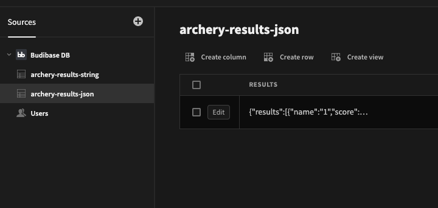

# Budibase Archery Component Plugin


## Description

This component tracks archery scores as they happen.

Features:
- Add archers to game
- Record scores for each archer as they happen
- Progress to next archer
- Save the results on the game when complete

Credit for the implementation of the target component, which has been ported from react to svelte in this plugin:
https://github.com/carabus/arrow-tracker

Find out more about [Budibase](https://github.com/Budibase/budibase).

## Settings

- `Target Size`
   - Change the size of the target (px) 
- `Target Type`
  - Choose between Olympic and NFAA style targets
- `Arrow Radius`
  - Change the size of arrows rendered on the target (px)
- `Stroke Width`
  - Change the size of lines between score boundaries on the target (px)
- `On Save Results`
  - Define the action that will receive the results of the game

### Handling Results

The results array has the following content
```js
[
  {
    name: "archer1", 
    score: 21
  },
  {
    name: "archer2",
    score: 28
  }
]
```

This object can be referenced from an action with the following bindings:
- Handlebars:
```handlebars
{{ Results }}
```
- JavaScript
```js
return $("Results")
```

#### Example: Saving to text field in Budibase DB

Configure a table as follows:


Configure an `On Save Results` action as follows:


### Example: Saving to json field in Budibase DB




Configure an `On Save Results` action as follows:


With the following JavaScript function:


## Screenshots

### New Component


### Add Archers


### Game In-Progress


### NFAA Target


### Multiple Targets

Multiple targets can be added to an app to model an archery range


## Instructions

To build this plugin run the following in your Budibase CLI:
```
budi plugins --build
```

You can also re-build everytime you make a change to your plugin with the command:
```
budi plugins --watch
```

